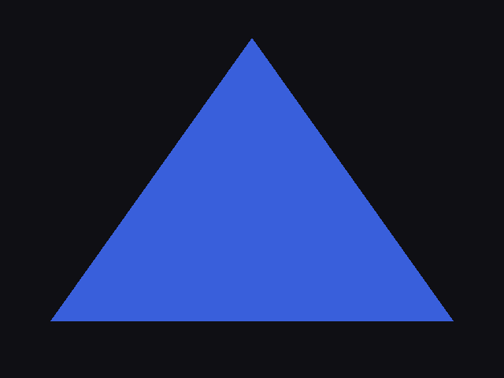

# triangle

The smallest program that proves the library: a native window, a 4.6 core context, a GLSL program the
driver compiles, and a triangle drawn through a vertex array.

```
polaron run .
```

```
centre = 57,95,219   corner = 15,15,20
wrote triangle.png
the triangle is on the screen
```



## It checks itself

A demo that opens a window and prints "ok" has proved that a window opened. This one reads the frame back
off the GPU with `glReadPixels` and looks at two pixels: the centre, which is inside the triangle and must
carry the fill colour (57, 95, 219 — Polaron's blue, chosen because no cleared buffer could produce it),
and a corner, which is outside it and must still carry the clear colour. A run that renders nothing says
so and the numbers say why.

The frame is written to `triangle.png` as well, encoded in Polaron from the standard library's `Zlib` and
`Crc32` — for the case where both pixels are right and the picture is still wrong.

## What it does not need

Look at `polaron.toml`: one path dependency and no `[libraries]` section, no `native_libs` line, no
mention of opengl32 or gdi32. Each class in the library names the foreign library it comes from, the
library's manifest maps that name to a file per platform, and the link inherits it.
